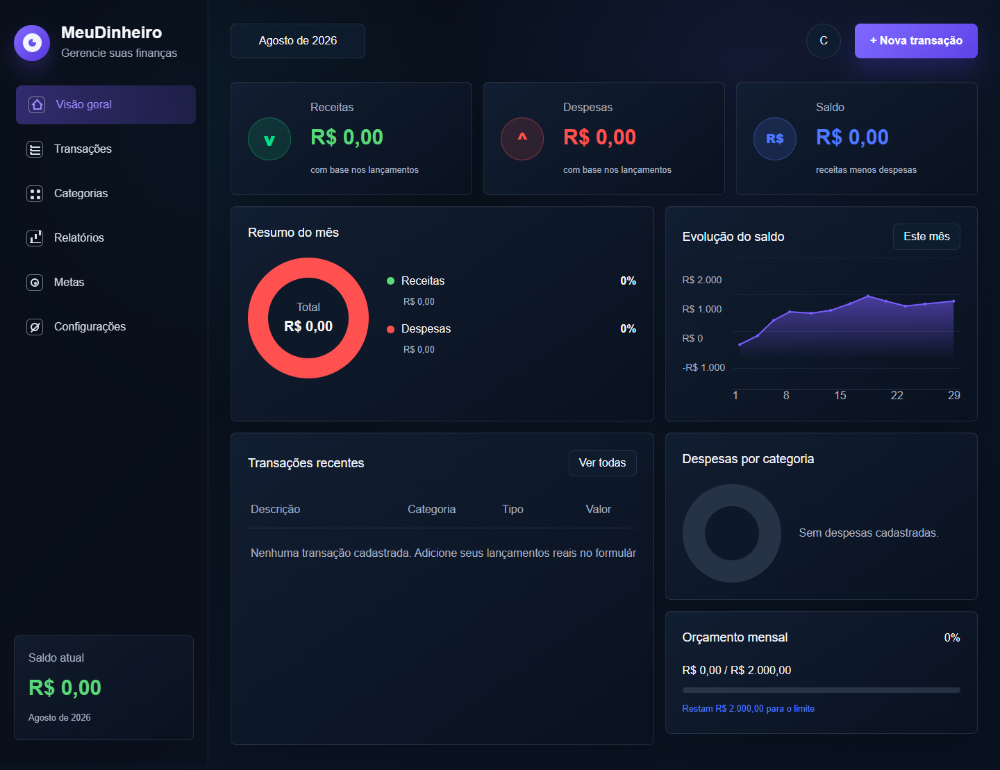
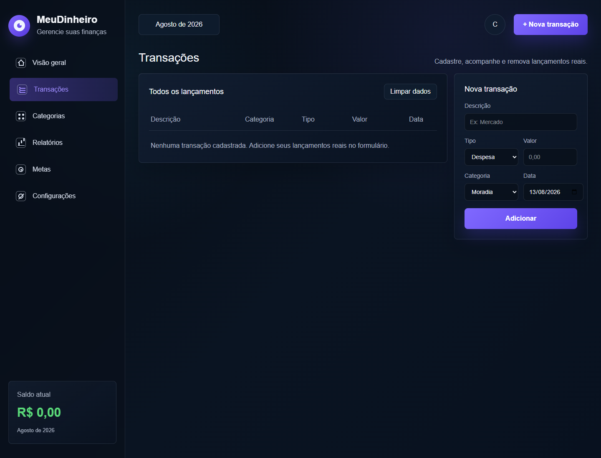
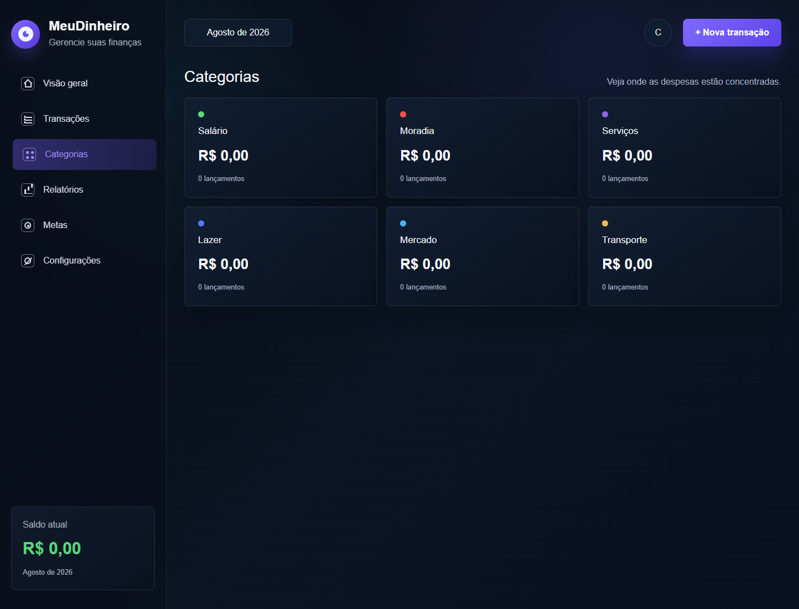
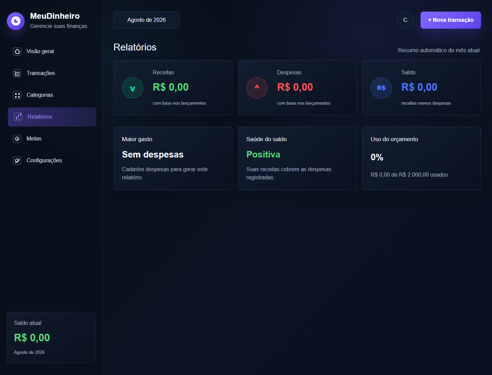
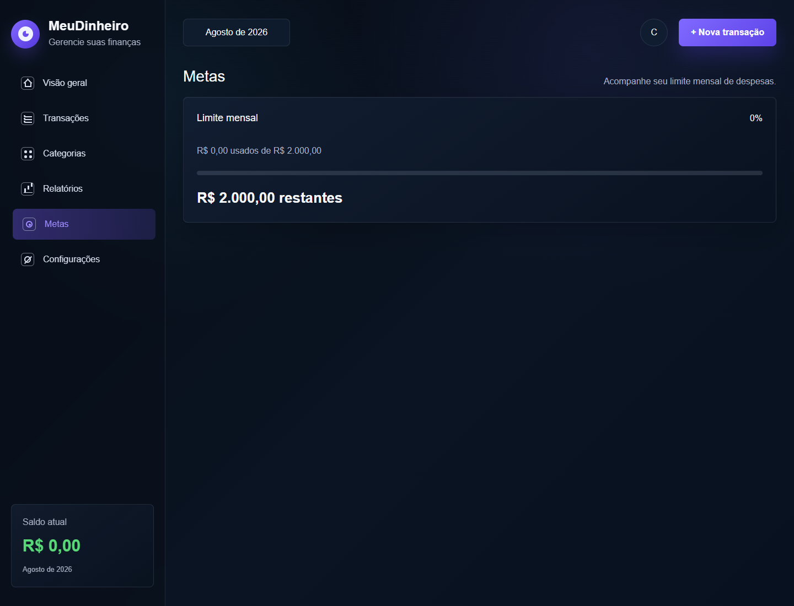
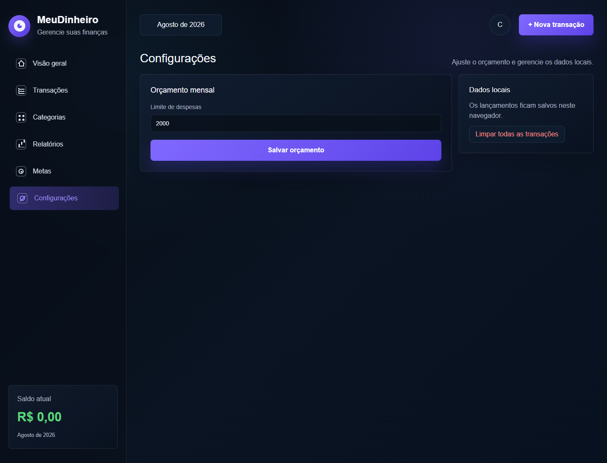

<div align="center">

# 💰 MeuDinheiro

### Gerenciador financeiro pessoal simples, visual e direto ao ponto

Acompanhe receitas, despesas, categorias, metas e relatórios em um dashboard financeiro organizado e responsivo.

<br>

[](https://meu-dinheiro-mauve.vercel.app/)

<br>


</div>

---

## 📖 Sobre o projeto

O **MeuDinheiro** é uma aplicação web de gerenciamento financeiro pessoal criada para facilitar o acompanhamento de receitas, despesas e saldo mensal.

A aplicação centraliza as principais informações financeiras em um dashboard, permitindo registrar movimentações, organizar gastos por categoria, acompanhar metas de orçamento e visualizar relatórios automáticos.

Os dados são armazenados diretamente no navegador utilizando `localStorage`, mantendo o projeto simples e sem necessidade de banco de dados ou autenticação.

---

## 🌐 Demonstração

A aplicação poderá ser acessada online em:

👉 **[Acessar MeuDinheiro](https://meu-dinheiro-mauve.vercel.app/)**

---

## 📸 Screenshots

### 📊 Visão geral



---

### 💳 Transações



---

### 🗂️ Categorias



---

### 📈 Relatórios



---

### 🎯 Metas



---

### ⚙️ Configurações



---

## ✨ Funcionalidades

### 💵 Receitas e despesas

O usuário pode cadastrar diferentes movimentações financeiras, separando-as entre:

* Receitas
* Despesas

Os valores são utilizados automaticamente para calcular o saldo disponível.

---

### 📊 Dashboard financeiro

A tela principal apresenta uma visão resumida das finanças por meio de cards e gráficos.

Entre as principais informações estão:

* Total de receitas
* Total de despesas
* Saldo atual
* Resumo mensal
* Distribuição dos gastos

---

### 💳 Controle de transações

A aplicação possui uma área dedicada às movimentações financeiras.

Nela é possível:

* Visualizar lançamentos
* Acompanhar receitas
* Acompanhar despesas
* Remover transações
* Consultar valores registrados

---

### 🗂️ Categorias

As despesas podem ser organizadas por categorias, facilitando a identificação dos principais destinos do dinheiro.

Isso permite entender melhor como os gastos estão distribuídos ao longo do mês.

---

### 📈 Relatórios

O MeuDinheiro gera indicadores financeiros automaticamente a partir das movimentações cadastradas.

Entre eles:

* Maior gasto
* Saúde do saldo
* Utilização do orçamento
* Resumo das movimentações

---

### 🎯 Metas de orçamento

É possível definir uma meta mensal de despesas e acompanhar quanto do orçamento já foi utilizado.

Esse recurso ajuda a visualizar rapidamente se os gastos estão dentro do limite planejado.

---

### ⚙️ Configurações

A aplicação possui uma área para ajustes relacionados ao controle financeiro, incluindo a definição do limite de orçamento mensal.

---

## 💾 Persistência local

O MeuDinheiro utiliza `localStorage` para salvar os dados diretamente no navegador.

```text id="92rb0g"
Usuário
   │
   ▼
Adiciona uma transação
   │
   ├── Receita
   └── Despesa
   │
   ▼
LocalStorage
   │
   ├── Transações
   ├── Categorias
   ├── Metas
   └── Configurações
   │
   ▼
Dashboard
   │
   ├── Saldo
   ├── Relatórios
   ├── Gráficos
   └── Orçamento
```

Os dados permanecem disponíveis mesmo após atualizar ou fechar a página, desde que o armazenamento do navegador não seja apagado.

---

## 🛠️ Tecnologias

**Next.js, React, TypeScript, CSS, LocalStorage**

### Front-end

* Next.js
* React
* TypeScript
* CSS

### Persistência

* LocalStorage

---

## 📂 Estrutura do projeto

```text id="66m0hk"
MeuDinheiro/
│
├── app/
├── public/
├── screenshots/
│   ├── visao-geral.png
│   ├── transacoes.png
│   ├── categorias.png
│   ├── relatorios.png
│   ├── metas.png
│   └── configuracoes.png
│
├── next.config.ts
├── package.json
├── package-lock.json
├── tsconfig.json
├── eslint.config.mjs
├── postcss.config.mjs
└── README.md
```

---

## 🚀 Como executar localmente

### 1. Clone o repositório

```bash id="lyl1ey"
git clone https://github.com/EmanuelFHX/MeuDinheiro.git
```

### 2. Entre na pasta

```bash id="267cxc"
cd MeuDinheiro
```

### 3. Instale as dependências

```bash id="jekzcr"
npm install
```

### 4. Inicie o servidor de desenvolvimento

```bash id="mud829"
npm run dev
```

### 5. Acesse no navegador

```text id="37k2p3"
http://localhost:3000
```

---

## 📦 Build

Para gerar uma build de produção:

```bash id="7n8bpm"
npm run build
```

---

## 🎯 Objetivo

O objetivo do **MeuDinheiro** é oferecer uma ferramenta simples e visual para acompanhar finanças pessoais sem transformar a experiência em um sistema financeiro complexo.

A proposta é permitir que o usuário registre suas movimentações e obtenha rapidamente uma visão clara sobre receitas, despesas, saldo, categorias e orçamento mensal.

---

## 🎯 Objetivos técnicos

O projeto também foi desenvolvido para trabalhar conceitos como:

* Next.js
* React
* TypeScript
* Componentização
* Gerenciamento de estado
* Manipulação de dados financeiros
* Cálculos automáticos
* Persistência com LocalStorage
* Dashboards
* Visualização de dados
* Design responsivo
* Organização de interfaces

---

## ⚠️ Escopo do projeto

O MeuDinheiro utiliza armazenamento local no navegador e não possui autenticação ou banco de dados remoto.

Isso significa que os dados financeiros ficam disponíveis somente no navegador e dispositivo onde foram cadastrados.

O projeto foi desenvolvido como uma ferramenta de controle financeiro pessoal e como demonstração de conceitos de desenvolvimento front-end.

---

## 🚀 Possíveis melhorias

* Banco de dados em nuvem
* Autenticação de usuários
* Sincronização entre dispositivos
* Transações recorrentes
* Controle por contas bancárias
* Cartões de crédito
* Parcelamento de despesas
* Filtros por período
* Exportação em CSV
* Exportação em PDF
* Comparação entre meses
* Gráficos históricos
* Metas de economia
* Backup e restauração dos dados

---

## 📈 Status

O **MeuDinheiro** está funcional e pode continuar evoluindo com novos recursos de organização e análise financeira.

---

## 👨‍💻 Autor

**Emanuel Penna**

[](https://www.linkedin.com/in/emanuel-penna)

[](https://github.com/EmanuelFHX)

[](https://portfolio-emanuel-penna.vercel.app/)
